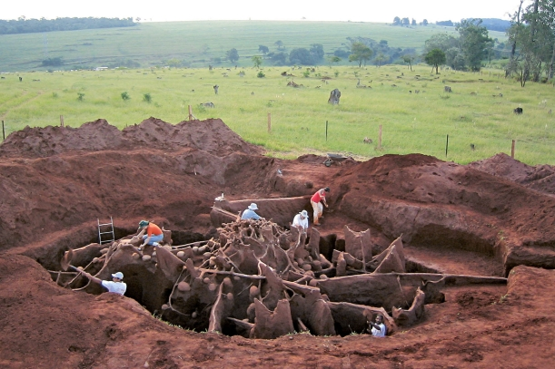
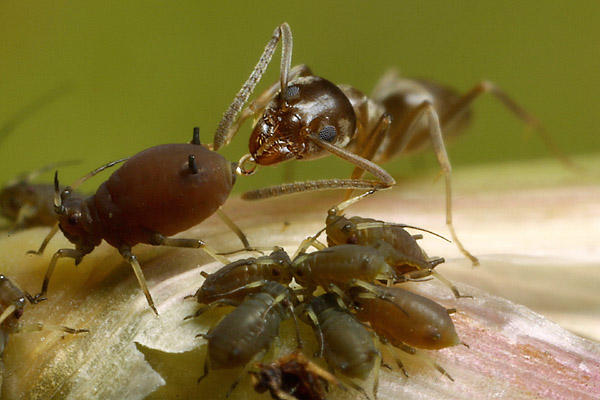
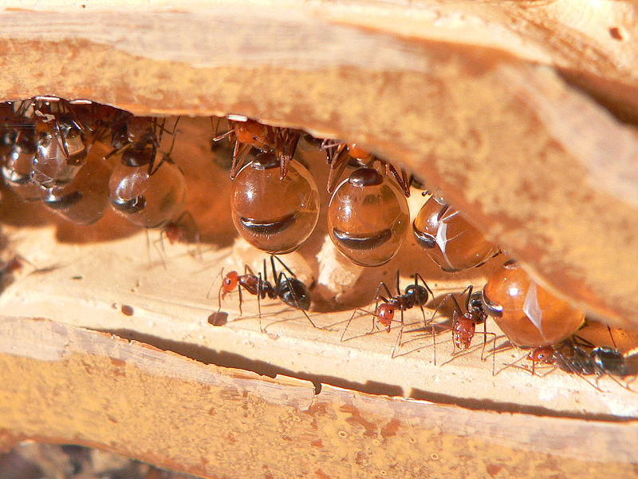
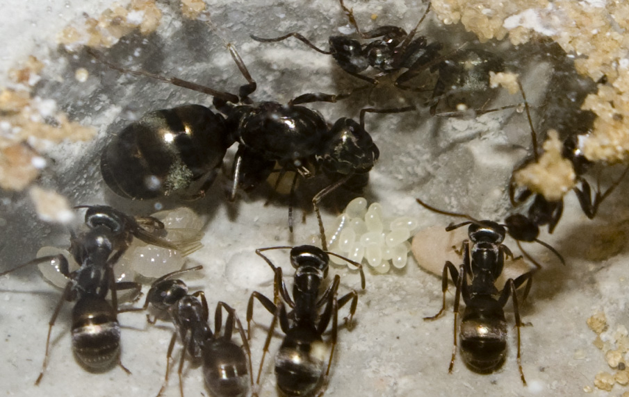
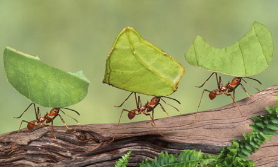
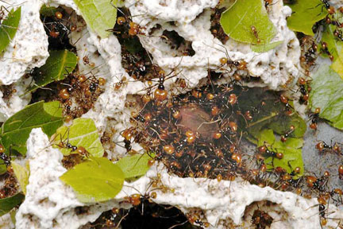
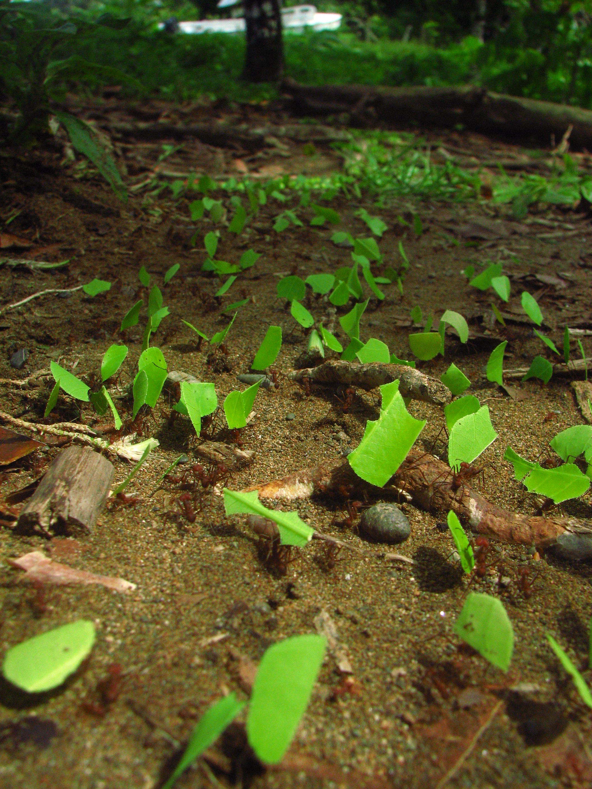
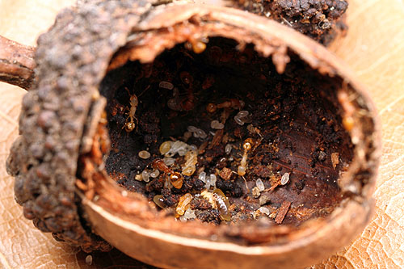

# Lesplan

 * Docent: Richel Bilderbeek
 * Gastdocent: Boris Kramer

## Context

 * Tweede helft van de derde les, na een lesuur gedrag door Kevin 
 * Aantal leerlingen geschat op 2 t/m 4

## Lesdoelen

 * Levenscyclus mier: ei, larve, pop, mier
 * Gedrag mieren: eieren leggen, koningin/eieren/larven/poppen verzorgen, afval wegbrengen, soldaten
 * Gedrag miersoorten: akkerbouw, veeteelt, slavernij
 * Verzorging mieren: suikerwater en eiwitten

## Voorbereiding

Op het bord:

```
19:45 Mierenkolonie Boris
19:50 Woordweb mieren
19:55 Waarom zijn mieren cool?
20:00 Levenstadia, taken en verzorging opzoeken
20:10 Bespreken
20:15 Filmpje
20:20 Verzorgen mier
20:25 Nabespreking

DJOG1402
```

## Lesplanning

Iedereen DIYbio T-shirt aan!

Iemand anders vinden om de ranja in te schenken

 * 19:30: voorbereiding: 
   * Boris zet zijn mierenkolonie op de middentafel
   * [filmpje laden](https://www.youtube.com/watch?v=lFg21x2sj-M)
 * 19:45: start les: mierenkolonie Boris + woordweb: observeren gedrag
 * ??:??: Waarom zijn mieren cool?
   * Veeteelt: Lasius Niger, wegmier, ook wel zwarte wegmier of zwartbruine wegmier, black garden ant: verbouwen bladluizen
   * Landbouw: Atta en Acromyrmex, bladsnijdersmieren, leafcutter ant: schimmels als voer
   * Slavernij: Temnothorax, stengelslankmieren, acorn ant 
 * Welke levenstadia heeft een mier?
 * Hoeveel kasten (vrouwtjes, mannetjes, koninginnen) zitten er in een mierenkolonie?
 * Wat heeft een mier nodig?
 * ??:??: filmpje [hiero](https://www.youtube.com/watch?v=lFg21x2sj-M)
 * !Verzorging mier: suikerwater, eiwit, donder of rood
 * !Ontwerp een mierenkolonie?
 * Vraag het Boris

## Acknowledgements

## Source unknown



## Source unknown



## https://nl.wikipedia.org/wiki/Honingpotmieren#/media/File:HoneyAnt.jpg



## https://commons.wikimedia.org/wiki/File:Hurtnica_pospolita.jpg



## Source unknown



## Source unknown



## https://en.wikipedia.org/wiki/Leafcutter_ant#/media/File:Leafcutter_ants_transporting_leaves.jpg



## antfarm.yuku.com



