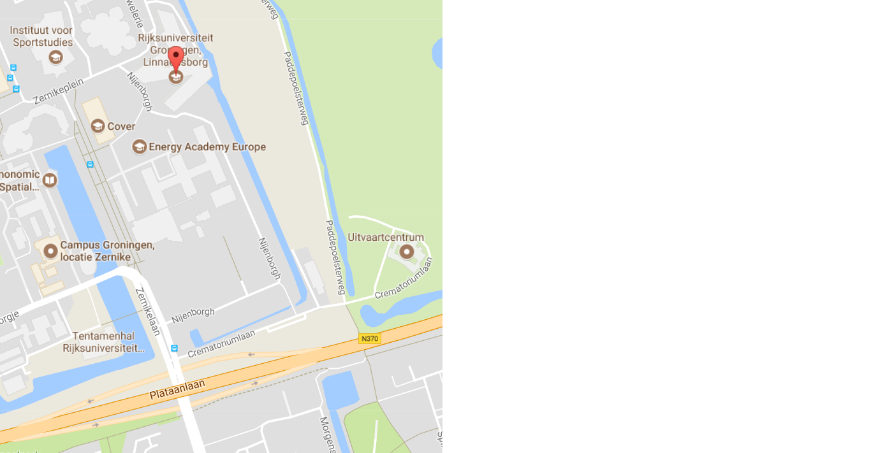

# Workshop

We gaan met bezoekers DNA uit aardbeien halen.
Jullie gaan deze workshop geven!
Doe je mee?

Zo ja, mail dan richel@richelbilderbeek.nl

 * Wat: Week van de Biologie
 * Wanneer: vrijdag 29 september 16:00-19:00
 * Waar: Linnaeusborg, Nijenborgh 7, 9747 AG Groningen

De kids worden goed verzorgd en krijgen genoeg vrije tijd :-)

## Vragen

### Mag ik later komen? 

Dat kan prima!

### Mag ik eerder terug?

Jazeker!

### Kan ik daarna weer terug naar de cursus?

Nou en of!

### Is er ook wat te doen voor de ouders?

Ja, er is een rondleiding met ook andere activiteiten in dit speciale gebouw.

Zie eventueel http://www.weekvandebiologie.nl/activiteiten/rondleiding-in-het-centrum-voor-levenswetenschappen