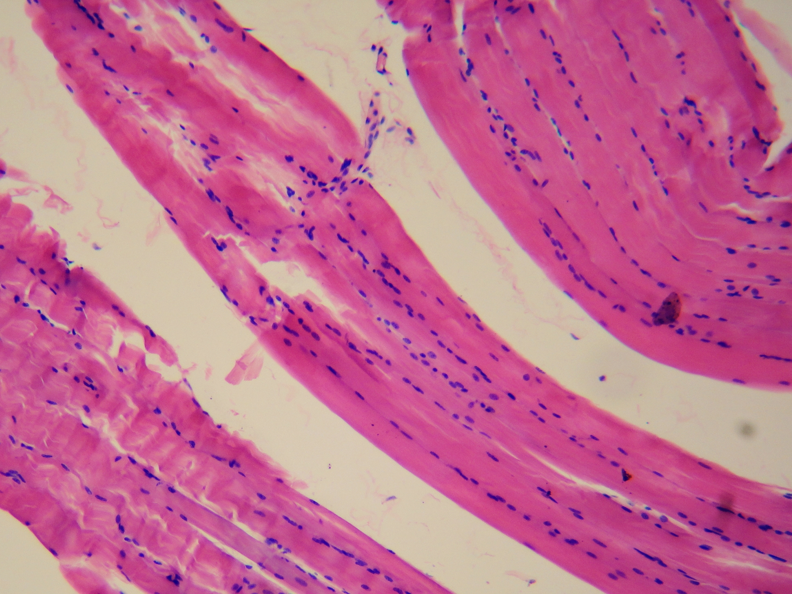

# Allometrie

Organismen hebben verschillende groottes.

In deze les leren we:

 * hoe knap het is dat een mier 50x haar eigen gewicht kan tillen

## Waarom

Grootte is een belangrijke eigenschap van levende wezens.

Grootte bepaalt onder andere:

 * de hartslag (hoe vaak het hart klopt)
 * of het organisme kan vliegen
 * of het organisme kan lopen

## Waarom je slapper wordt als je groter bent

Als je groter wordt, dan doe je dat in drie richtingen: je wordt breder, langer en dieper.
Je gewicht neemt in alle drie de richtingen toe.
Je spierkracht doet dat niet: alleen de spierdikte (en niet de lengte) bepaalt de kracht van een spier.




Stel je voor, met een machine wordt jij 2x zo lang gemaakt.
Dan ben je niet alleen 2x zo lang, maar ook 2x zo breed en 2x zo diep.
Je weegt dus 2x2x2=8 keer zo veel!
Je spieren worden maar 2x2=4 keer zo sterk.
Je bent dus 'slapper' geworden!

Dit gaan we nu berekenen met drie kubusdieren:


Ons eerste kubusdier is rood. 
Het dier is een kubus van 1x1x1 cm en weegt 1 gram.
Dit dier kan 3 keer zijn eigen gewicht tillen!


 * Wat is de oppervlakte van een vlak van de kubus?
 * Hoeveel tilt dit dier? En nu inclusief het gewicht van het dier zelf?
 * Hoeveel kan een vierkante centimeter spier dus tillen?

Nu vergroten we dit dier twee keer.


 * Hoe groot (lang, breed, diep) is het dier nu?
 * Hoe zwaar is het dier nu?
 * Hoeveel spieroppervlak heeft het dier nu?
 * Hoeveel kracht heeft het dier? 
 * Hoeveel keer z'n eigen gewicht tilt dit dier nu?

Je ziet dat het dier minder vaak zijn gewicht kan tillen!

Dit is de reden waarom landdieren niet te groot kunnen worden: 
ze kunnen hun eigen gewicht dan niet meer dragen!
De dinosauriers zijn de grootste landdieren ooit geweest
en er zullen waarschijnlijk nooit grotere landdieren ontstaan:


Een van de grootste is de Argentinosaurus, die 35 meter lang was:


Terug naar ons kubusdier.

Ons kubusdier was nu 2x2x2 centimeter. 
Nu vergroten we dit dier nog eens twee keer:


 * Hoe groot (lang, breed, diep) is het dier nu?
 * Hoe zwaar is het dier nu?
 * Hoeveel spieroppervlak heeft het dier nu?
 * Hoeveel kracht heeft het dier? 
 * Hoeveel keer z'n eigen gewicht tilt dit dier nu?

## Eigenschappen van een mier


Een mierenwerkster ...

 * weegt gemiddeld 3 milligram
 * is gemiddeld 3 mm lang
 * kan 50x haar gewicht dragen 

## Berekening

 * Hoeveel kan een mier tillen?
 * Hoeveel spier is een mier?
 * Hoe sterk is een spier?
 * Hoeveel spier is een mens?
 * Hoe sterk is deze spier?


## Hoeveel kan een mier tillen?

Hoeveel milligram kan een mier dragen?

```

```

Hints

 * Dit is een keersom

Dit is wat een mier kan dragen.
Maar een mier heeft zelf ook een gewicht. 
Een mier tilt ook zichzelf.

Hoeveel milligram kan een mier tillen, als je het eigen gewicht meetelt?

```

```

Hints

 * Hiervoor heb je plus nodig

## Hoeveel spier is een mier?

We gaan net doen alsof de mier een spier is.
De vorm van die spier is een kubus.
Een mier weegt 3 milligram.
3 milligram is 3 kubieke millimeter.
Hoe groot is een kubus van 3 kubieke millimeter?

Maak de tabel af. Gebruik een rekenmachientje.

Grootte kubus (lengte, breedte en hoogte)|Inhoud van de kubus
---|---
1 mm|
2 mm|
3 mm|
4 mm|
5 mm|

Een mierspier heeft een inhoud van 3 kubieke millimeter.
Dit moet een kubus zijn met een grootte tussen `   ` mm en `    ` mm.
Nu gaan we preciezer rekenen tussen die twee getallen:

Grootte kubus (lengte, breedte en hoogte)|Inhoud van de kubus
---|---
` `,0 mm|
` `,1 mm|
` `,2 mm|
` `,3 mm|
` `,4 mm|
` `,5 mm|
` `,6 mm|
` `,7 mm|
` `,8 mm|
` `,9 mm|
` `,0 mm|


## Hoe sterk is een spier?

 * Hoeveel spier is een mens?
 * Hoe sterk is deze spier?


Dit is dus 51 * 33 mg = 1683 mg

We nemen aan dat een mier dezelfde dichtheid heeft als water, dus 1 gram per kubieke millimeter.
Dan is de mier dus 3 kubieke millimeter

We gaan nu van de mier een kubus maken, met als inhoud 3 kubieke millimeter.
We weten dat:

```
inhoud = lengte * breedte * hoogte
```

Bij een kubus is de lengte gelijk aan de breedte en aan de hoogte.

```
3 mm3 = lengte * breedte * hoogte
```

Met wat proberen kom je erop uit dat 1.44 mm * 1.44 mm * 1.44 mm ongeveer 3.0 mm3 is.

We nemen aan dat de mier dus 1.44 mm bij 1.44 mm bij 1.44 millimeter is.

Nu doen we net alsof de mier alleen maar uit spieren bestaat. 

De kracht van een spier wordt bepaalt door de dikte (de oppervlakte van de doorsnede) en niet door de lengte.

De spier heeft een dikte van 1.44 mm bij 1.44 is 2.08 mm2.

Een mier tilt 1883 mg met een spierdikte van 2.08 mm2.

Een mierenspier kan dus 1683 mg per 2.08 mm2 tillen, dit is 809 mg per mm2.

## Hoe sterk is een mier als we deze zo groot maken als een mens?

Een gemiddelde vrouw weegt 82 kilo.

We nemen aan dat een mens dezelfde dichtheid heeft als water, dus 1 kilo per kubieke decimeter.
Dan is de mens dus 83 kubieke decimeter.

We gaan nu van de mens een kubus maken, met als inhoud 33 kubieke decimeter.
We weten dat:

```
inhoud = lengte * breedte * hoogte
```

Bij een kubus is de lengte gelijk aan de breedte en aan de hoogte.

```
83 dm3 = lengte * breedte * hoogte
```

Met wat proberen kom je erop uit dat 4.36 dm * 4.36 dm  * 4.36 dm  ongeveer 83 dm3 is.

We nemen aan dat de mens dus 4.36 dm bij 4.36 dm bij 4.36 dm is.

Nu doen we net alsof de mens alleen maar uit mierenspieren bestaat. 

De kracht van een spier wordt bepaalt door de dikte (de oppervlakte van de doorsnede) en niet door de lengte.

De spier heeft een dikte van 4.36 dm bij 4.36 dm is 19.01 dm2.
Dit is 1901 cm2. Dit is 190100 mm2.

Een mierenspier tilr 809 mg per mm2.

Een mens zou dan 190100 mm2 * 809 mg/mm2 = 153787664 mg moeten kunnen tillen.

153787664 mg = 153787.664 gram = 153.787664 kilogram.

De vrouw tilt al 82 kilo lichaamsgewicht.

154 - 82 = 72 kg

Dus als een vrouw 72 kilo tilt, is ze even hard aan het werk als een mier.

Het wereldrecord gewichtheffen voor vrouwen is 155 kilo van [Tatiana Kashirina](https://www.youtube.com/watch?v=2pfLY_a5s_U)).
Tatiana zou misschien goed rond kunnen lopen met 72 kilo.

Je zou dus kunnen zeggen dat een mier ongeveer net zo sterk is als een getrainde gewichtheffer!


