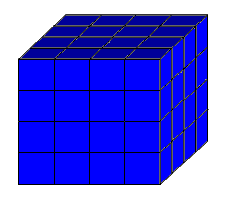
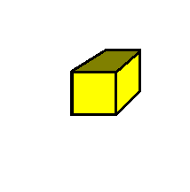
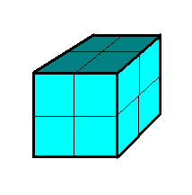

# Allometrie

Organismen hebben verschillende groottes.

In deze les leren we:

 * hoe knap het is dat een mier 50x haar eigen gewicht kan tillen

## Waarom

Grootte is een belangrijke eigenschap van levende wezens.

Grootte bepaalt onder andere:

 * de hartslag (hoe vaak het hart klopt)
 * of het organisme kan vliegen
 * of het organisme kan lopen

## Waarom je slapper wordt als je groter bent

Als je groter wordt, dan doe je dat in drie richtingen: je wordt breder, langer en dieper.
Je gewicht neemt in alle drie de richtingen toe.
Je spierkracht doet dat niet: alleen de spierdikte (en niet de lengte) bepaalt de kracht van een spier.


Stel je voor, met een machine wordt jij 2x zo lang gemaakt.
Dan ben je niet alleen 2x zo lang, maar ook 2x zo breed en 2x zo diep.
Je weegt dus 2x2x2=8 keer zo veel!
Je spieren worden maar 2x2=4 keer zo sterk.
Je bent dus 'slapper' geworden!

Dit gaan we nu berekenen met drie kubusdieren:




Ons eerste kubusdier is rood. 
Het dier is een kubus van 1x1x1 cm en weegt 1 gram.
Dit dier kan 3 keer zijn eigen gewicht tillen!


 * Wat is de oppervlakte van een vlak van de kubus?
 * Hoeveel tilt dit dier? En nu inclusief het gewicht van het dier zelf?
 * Hoeveel kan een vierkante centimeter spier dus tillen?

Dus:

 * Kubusdier 1 heeft een inhoud van `____` kubieke centimeter
 * Kubusdier 1 heeft een gewicht van `____` gram
 * Kubusdier 1 heeft een grootte van `____` centimeter bij  `____` centimeter bij  `____` centimeter
 * Kubusdier 1 heeft een spieropperlak van  `____` centimeter bij  `____` centimeter, dus `____` vierkante centimeter
 * Een spier kan `____` gram tillen per vierkante centimeter
 * Kubusdier 1 kan in totaal `____` gram tillen
 * Kubusdier 1 kan `____` gram meedragen
 * Kubusdier 1 tilt `____` zijn eigen gewicht

Nu vergroten we dit dier twee keer.


 * Hoe groot (lang, breed, diep) is het dier nu?
 * Hoe zwaar is het dier nu?
 * Hoeveel spieroppervlak heeft het dier nu?
 * Hoeveel kracht heeft het dier? 
 * Hoeveel keer z'n eigen gewicht tilt dit dier nu?

Dus:

 * Kubusdier 2 heeft een inhoud van `____` kubieke centimeter
 * Kubusdier 2 heeft een gewicht van `____` gram
 * Kubusdier 2 heeft een grootte van `____` centimeter bij  `____` centimeter bij  `____` centimeter
 * Kubusdier 2 heeft een spieropperlak van  `____` centimeter bij  `____` centimeter, dus `____` vierkante centimeter
 * Een spier kan `____` gram tillen per vierkante centimeter
 * Kubusdier 2 kan in totaal `____` gram tillen
 * Kubusdier 2 kan `____` gram meedragen
 * Kubusdier 2 tilt `____` zijn eigen gewicht

Je ziet dat het dier minder vaak zijn gewicht kan tillen!

Dit is de reden waarom landdieren niet te groot kunnen worden: 
ze kunnen hun eigen gewicht dan niet meer dragen!
De dinosauriers zijn de grootste landdieren ooit geweest
en er zullen waarschijnlijk nooit grotere landdieren ontstaan:


Een van de grootste is de Argentinosaurus, die 35 meter lang was:


Terug naar ons kubusdier.

Ons kubusdier was nu 2x2x2 centimeter. 
Nu vergroten we dit dier nog eens twee keer:


 * Hoe groot (lang, breed, diep) is het dier nu?
 * Hoe zwaar is het dier nu?
 * Hoeveel spieroppervlak heeft het dier nu?
 * Hoeveel kracht heeft het dier? 
 * Hoeveel keer z'n eigen gewicht tilt dit dier nu?

Dus:

 * Kubusdier 3 heeft een inhoud van `____` kubieke centimeter
 * Kubusdier 3 heeft een gewicht van `____` gram
 * Kubusdier 3 heeft een grootte van `____` centimeter bij  `____` centimeter bij  `____` centimeter
 * Kubusdier 3 heeft een spieropperlak van  `____` centimeter bij  `____` centimeter, dus `____` vierkante centimeter
 * Een spier kan `____` gram tillen per vierkante centimeter
 * Kubusdier 3 kan in totaal `____` gram tillen
 * Kubusdier 3 kan `____` gram meedragen
 * Kubusdier 3 tilt `____` zijn eigen gewicht

## Eigenschappen van een mier


Een mierenwerkster ...

 * weegt gemiddeld 3 milligram
 * is gemiddeld 3 mm lang
 * kan 50x haar gewicht dragen 

## Overzicht berekening

We maken van de mier ook een kubusdier.
We gaan deze getallen berekenen:

 * Een kubusmier heeft een inhoud van `____` kubieke millimeter
 * Een kubusmier heeft een gewicht van `____` milligram
 * Een kubusmier heeft een grootte van `____` milliimeter bij  `____` millimeter bij  `____` millimeter
 * Een kubusmier heeft een spieropperlak van  `____` millimeter bij  `____` millimeter, dus `____` vierkante millimeter
 * Een kubusmierspier kan `____` milligram tillen per vierkante millimeter
 * Een kubusmier kan in totaal `____` milligram tillen
 * Een kubusmier kan `____` milligram meedragen
 * Een kubusmier tilt `____` zijn eigen gewicht

## Hoeveel kan een mier tillen?

Hoeveel milligram kan een mier dragen?

```

```

Dit is wat een mier kan dragen.
Maar een mier heeft zelf ook een gewicht. 
Een mier tilt ook zichzelf.

Hoeveel milligram kan een mier tillen, als je het eigen gewicht meetelt?

```

```

## Hoeveel spier is een mier?

We gaan nu van de mier een kubusdier maken.
Een mier weegt 3 milligram.
3 milligram is 3 kubieke millimeter.
Hoe groot is een kubus met een inhoud van 3 kubieke millimeter?

Maak de tabel af. Gebruik een rekenmachientje.

Grootte kubus (lengte, breedte en hoogte)|Inhoud van de kubus
---|---
1 millimeter|1 kubieke millimeter
2 millimeter|`____` kubieke millimeter 
3 millimeter|`____` kubieke millimeter
4 millimeter|`____` kubieke millimeter
5 millimeter|`____` kubieke millimeter

Een mierspier heeft een inhoud van 3 kubieke millimeter.
Dit moet een kubus zijn met een grootte tussen `   ` mm en `    ` mm.
Nu gaan we preciezer rekenen tussen die twee getallen:

Grootte kubus (lengte, breedte en hoogte)|Inhoud van de kubus
---|---
` `,0 millimeter|`__,____` kubieke millimeter
` `,1 millimeter|`__,____` kubieke millimeter
` `,2 millimeter|`__,____` kubieke millimeter
` `,3 millimeter|`__,____` kubieke millimeter
` `,4 millimeter|`__,____` kubieke millimeter
` `,5 millimeter|`__,____` kubieke millimeter
` `,6 millimeter|`__,____` kubieke millimeter
` `,7 millimeter|`__,____` kubieke millimeter
` `,8 millimeter|`__,____` kubieke millimeter
` `,9 millimeter|`__,____` kubieke millimeter
` `,0 millimeter|`__,____` kubieke millimeter

Tussen welke twee groottes zit de grootte van een kubusmier in?

Nu gaan we weer preciezer rekenen:

Grootte kubus (lengte, breedte en hoogte)|Inhoud van de kubus
---|---
` `,` `0 mm|`__,______` kubieke millimeter
` `,` `1 mm|`__,______` kubieke millimeter
` `,` `2 mm|`__,______` kubieke millimeter
` `,` `3 mm|`__,______` kubieke millimeter
` `,` `4 mm|`__,______` kubieke millimeter
` `,` `5 mm|`__,______` kubieke millimeter
` `,` `6 mm|`__,______` kubieke millimeter
` `,` `7 mm|`__,______` kubieke millimeter
` `,` `8 mm|`__,______` kubieke millimeter
` `,` `9 mm|`__,______` kubieke millimeter
` `,` `0 mm|`__,______` kubieke millimeter

Dus:
 * :white_check_mark: Een kubusmier heeft een inhoud van `____` kubieke millimeter
 * :white_check_mark: Een kubusmier heeft een gewicht van `____` milligram
 * :white_check_mark: Een kubusmier heeft een grootte van `____` millimeter bij  `____` millimeter bij  `____` millimeter
 * :white_check_mark: Een kubusmier heeft een spieropperlak van  `____` millimeter bij  `____` millimeter, dus `____` vierkante millimeter
 * Een kubusmierspier kan `____` milligram tillen per vierkante millimeter
 * :white_check_mark: Een kubusmier kan in totaal `____` milligram tillen
 * :white_check_mark: Een kubusmier kan `____` milligram meedragen
 * :white_check_mark: Een kubusmier tilt `____` zijn eigen gewicht

## Hoe sterk is een kubusmierspier?

Hoe sterk een spier is hangt af van hoeveel de spier kan tillen per oppervlakte.

We gaan dit eerst berekenen voor een geel kubusdier:



Kan tillen in totaal|Heeft spieroppervlak|Tilt dus
---|---|---
1 gram|1 vierkante centimeter|1 gram per vierkante centimeter
2 gram|1 vierkante centimeter|`____` gram per vierkante centimeter
3 gram|1 vierkante centimeter|`____` gram per vierkante centimeter
4 gram|1 vierkante centimeter|`____` gram per vierkante centimeter
5 gram|1 vierkante centimeter|`____` gram per vierkante centimeter
6 gram|1 vierkante centimeter|`____` gram per vierkante centimeter
7 gram|1 vierkante centimeter|`____` gram per vierkante centimeter
8 gram|1 vierkante centimeter|`____` gram per vierkante centimeter

Nu voor een cyaan kubusdier:



Kan tillen in totaal|Heeft spieroppervlak|Tilt dus
---|---|---
1 gram|`____` vierkante centimeter|`____` gram per vierkante centimeter
2 gram|`____` vierkante centimeter|`____` gram per vierkante centimeter
3 gram|`____` vierkante centimeter|`____` gram per vierkante centimeter
4 gram|`____` vierkante centimeter|`____` gram per vierkante centimeter
5 gram|`____` vierkante centimeter|`____` gram per vierkante centimeter
6 gram|`____` vierkante centimeter|`____` gram per vierkante centimeter
7 gram|`____` vierkante centimeter|`____` gram per vierkante centimeter
8 gram|`____` vierkante centimeter|`____` gram per vierkante centimeter

Dus:

 * :white_check_mark: Een kubusmier heeft een inhoud van `____` kubieke millimeter
 * :white_check_mark: Een kubusmier heeft een gewicht van `____` milligram
 * :white_check_mark: Een kubusmier heeft een grootte van `____` millimeter bij  `____` millimeter bij  `____` millimeter
 * :white_check_mark: Een kubusmier heeft een spieropperlak van  `____` millimeter bij  `____` millimeter, dus `____` vierkante millimeter
 * :white_check_mark: Een kubusmierspier kan `____` milligram tillen per vierkante millimeter
 * :white_check_mark: Een kubusmier kan in totaal `____` milligram tillen
 * :white_check_mark: Een kubusmier kan `____` milligram meedragen
 * :white_check_mark: Een kubusmier tilt `____` zijn eigen gewicht

## Hoe sterk is een mier als we deze zo groot maken als een mens?

Een gemiddelde vrouw weegt 82 kilo.
Dit is 82 kubieke decimeter
Nu gaan we een menskubusspier maken:

Grootte kubus (lengte, breedte en hoogte)|Inhoud van de kubus
---|---
1 decimeter|1 kubieke decimeter
2 decimeter|`____` kubieke decimeter
3 decimeter|`____` kubieke decimeter
4 decimeter|`____` kubieke decimeter
5 decimeter|`____` kubieke decimeter
6 decimeter|`____` kubieke decimeter

Een menskubusspier heeft een inhoud van 82 kubieke decimeter.
Dit moet een kubus zijn met een grootte tussen `   ` decimeter en `    ` decimeter.
Nu gaan we preciezer rekenen tussen die twee getallen:

Grootte kubus (lengte, breedte en hoogte)|Inhoud van de kubus
---|---
` `,0 decimeter|`__,____` kubieke decimeter
` `,1 decimeter|`__,____` kubieke decimeter
` `,2 decimeter|`__,____` kubieke decimeter
` `,3 decimeter|`__,____` kubieke decimeter
` `,4 decimeter|`__,____` kubieke decimeter
` `,5 decimeter|`__,____` kubieke decimeter
` `,6 decimeter|`__,____` kubieke decimeter
` `,7 decimeter|`__,____` kubieke decimeter
` `,8 decimeter|`__,____` kubieke decimeter
` `,9 decimeter|`__,____` kubieke decimeter
` `,0 decimeter|`__,____` kubieke decimeter

Tussen welke twee groottes zit de grootte van een menskubusspier in?

Nu gaan we weer preciezer rekenen:

Grootte kubus (lengte, breedte en hoogte)|Inhoud van de kubus
---|---
` `,` `0 decimeter|`__,______` kubieke decimeter
` `,` `1 decimeter|`__,______` kubieke decimeter
` `,` `2 decimeter|`__,______` kubieke decimeter
` `,` `3 decimeter|`__,______` kubieke decimeter
` `,` `4 decimeter|`__,______` kubieke decimeter
` `,` `5 decimeter|`__,______` kubieke decimeter
` `,` `6 decimeter|`__,______` kubieke decimeter
` `,` `7 decimeter|`__,______` kubieke decimeter
` `,` `8 decimeter|`__,______` kubieke decimeter
` `,` `9 decimeter|`__,______` kubieke decimeter
` `,` `0 decimeter|`__,______` kubieke decimeter

Dus:
 * :white_check_mark: Een kubusmens heeft een inhoud van `____` kubieke decimeter
 * :white_check_mark: Een kubusmens heeft een gewicht van `____` kilo
 * :white_check_mark: Een kubusmens heeft een grootte van `____` decimeter bij  `____` decimeter bij  `____` decimeter
 * :white_check_mark: Een kubusmens heeft een spieropperlak van  `____` decimeter bij  `____` decimeter, dus `____` vierkante decimeter
 * Een kubusmensspier kan `____` kilo tillen per vierkante decimeter
 * Een kubusmens kan in totaal `____` kilo tillen
 * Een kubusmens kan `____` kilo meedragen
 * Een kubusmens tilt `____` zijn eigen gewicht

## Omrekenen

Een mierenspier heeft een kracht van `____` milligram per vierkante millimeter.
Een mensenspie


De spier heeft een dikte van 4.36 dm bij 4.36 dm is 19.01 dm2.
Dit is 1901 cm2. Dit is 190100 mm2.

Een mierenspier tilr 809 mg per mm2.

Een mens zou dan 190100 mm2 * 809 mg/mm2 = 153787664 mg moeten kunnen tillen.

153787664 mg = 153787.664 gram = 153.787664 kilogram.

De vrouw tilt al 82 kilo lichaamsgewicht.

154 - 82 = 72 kg

Dus als een vrouw 72 kilo tilt, is ze even hard aan het werk als een mier.

Het wereldrecord gewichtheffen voor vrouwen is 155 kilo van [Tatiana Kashirina](https://www.youtube.com/watch?v=2pfLY_a5s_U)).
Tatiana zou misschien goed rond kunnen lopen met 72 kilo.

Je zou dus kunnen zeggen dat een mier ongeveer net zo sterk is als een getrainde gewichtheffer!


