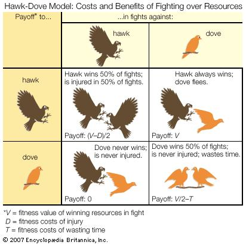

# Duiven en havikken

In deze les leer je een theorie waarom niet iedereen altijd aardig is.


## Duiven en havikken

Dit experiment speelt zich af in een stad.
In een stad zijn veel pleintjes.
Op een pleintje ligt soms wel en soms geen voedsel.

We doen net alsof er altijd twee vogels op een stuk voedsel afkomen.

Er zijn twee soorten vogels:

 * vogels die samenwerken: die noemen wij Duiven (ook al hoeven het geen duiven te zijn)
 * vogels die voor zichzelf kiezen: dit noemen wij Havikken (ook al hoeven het geen havikken te zijn)

```
Jij bent een Duif

Kom je een Duif tegen? 
Dan delen jullie het voedsel eerlijk. 
Jij krijgt vijf punten erbij.

Kom je een Havik tegen? 
Dan vlucht jij, zonder voedsel. 
Jij krijgt nul punten erbij.
```

```
Jij bent een Havik

Kom je een Duif tegen? 
Dan jaag jij de Duif weg en heb jij al het voedsel.
Jij krijgt tien punten erbij.

Kom je een Havik tegen? 
Dan vechten jullie en raak jij gewond
Jij verliest vijf punten
```


In dit spel moeten we zoveel mogelijk punten scoren.
Voedsel is tien punten waard.

## Opdrachten

 * Doe drie rondes als volgt:
   * Kies een rol, Havik of Duif
   * Kom iedereen tegen en houd je eigen score bij
   * Schrijf van iedereen op: de rol en de score 
 * Als je weet dat iedereen Duif is, wat is dan het slimst om te zijn?
 * Als je weet dat iedereen Havik is, wat is dan het slimst om te zijn?
 * 15+: kun je berekenen bij welke verhouding tussen Duiven en Havikken de Duiven gemiddeld net zoveel punten hebben als de Havikken? Ga ervan uit dat er 100 vogels zijn
 * 15+: hieronder staat een plaatje uit de Encyclopedia Brittanica. Welke getallen voor `V`, `D` en `T` heb ik gekozen?



 * Begin met alleen Duiven en een Havik. Speel een ronde. Een van de personen met de minste punten gaat dood. 
   De persoon die 'dood ging' krijgt dezelfde rol als de persoon met de meeste punten. Hoeveel havikken komen er?

## Oplossing

Er is een fractie (dit is een getal van nul tot en met een) `f_d` duiven.
Er is een fractie (dit is een getal van nul tot en met een) `f_h` havikken.

Een duif komt `f_d` duiven tegen en `f_h` havikken en krijgt hierdoor een score van `(f_d * 5) + (f_h * 0)`.
Een havik komt `f_d` duiven tegen en `f_h` havikken en krijgt hierdoor een score van `(f_d * 10) + (f_h * -5)`.

De vraag is wanneer de score gelijk is, dus wanneer `(f_d * 5) + (f_h * 0)` gelijk is aan `(f_d * 10) + (f_h * -5)`.
Dit kunnen we schrijven als: `(f_d * 5) + (f_h * 0) = (f_d * 10) + (f_h * -5)`

We weten `f_d + f_h = 1`, dus `f_d = 1 - f_h`.

We vullen de twee formules bij elkaar in:

```
(f_d * 5) + (f_h * 0) = (f_d * 10) + (f_h * -5)
f_d = 1 - f_h
```

f_d vervangen in de eerste formule door `1 - f_h`:

```
((1 - f_h) * 5) + (f_h * 0) = ((1 - f_h) * 10) + (f_h * -5)
```

Dit versimpelen:

```
(5 - 5f_h) + (0) = (10 - 10f_h) - (5f_h)
5 - 5f_h = 10 - 10f_h - 5f_h
5 - 5f_h = 10 - 15f_h
```

Beide kanten min `5` en plus `15f_h`, om links `f_h` over te houden:

```
5 - 5f_h = 10 - 15f_h
5 - 5f_h - 5 + 15f_h = 10 - 15f_h - 5 + 15f_h
10f_h = 5
f_h = 0.5
```

Dus als 50% havik is, dan is de score van duiven en havikken gelijk.

### Controle

Een duif komt `f_d` duiven tegen en `f_h` havikken en krijgt hierdoor een score van `(f_d * 5) + (f_h * 0)`. Voor een `f_h = 0.5 = f_d` wordt dat: `2.5`

Een havik komt `f_d` duiven tegen en `f_h` havikken en krijgt hierdoor een score van `(f_d * 10) + (f_h * -5)`. Voor een `f_h = 0.5 = f_d` wordt dat: `5 - 2.5 = 2.5`

