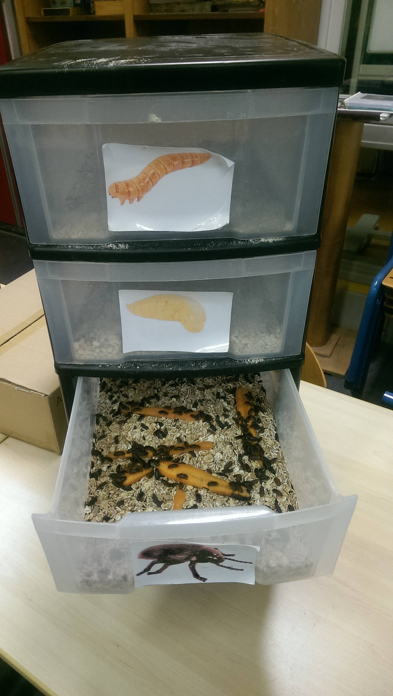
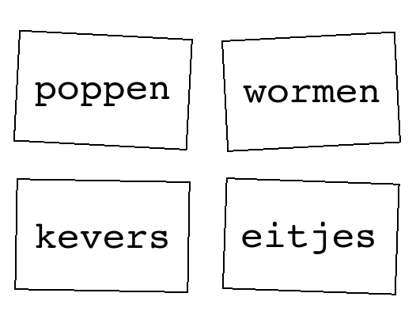

# Hoe verzorg ik de meelwormen?

In deze les leer je de meelwormen te verzorgen.

## De meelwormen boerderij

De meelwormen boerderij heeft vier laatjes. Van boven naar onder zijn dit:
 
 * Wormen
 * Poppen
 * Kevers
 * Eitjes

De kevers leggen eitjes. De eitjes worden wormen. De wormen zijn eerst klein, dan groot.
De wormen worden poppen. De poppen worden kevers. De kevers zijn eerst lichtbruin en 
worden als ze ouder worden zwart.

## Logboek

In het logboek houden we bij hoe het met de meelwormen gaat.

## Opdracht

Zet de vier bakken van de meelwormen in een vierkant, 
zoals bijvoorbeeld zo:

 * Zoek de eerste vrije bladzijde in het logboek
 * Schrijf op: 
   * de dag, bijvoorbeeld 'Woensdag 7 september 2016'
   * de toestand van de boerderij. Dit is een algemeen verhaal, zoals bijvoorbeeld: 'Er zijn drie wormen te zien. Deze zijn groot. De havermout zie je af en toe bewegen. Er zijn ongeveer 10 poppen en 200 kevers. Er zijn tientallen jonge wormpjes te zien in de la met eitjes'
 * In de la van de wormen: 
   * tel de hoeveelheid poppen en schrijf dit op in het logboek. Verplaats de poppen naar de la van de poppen
   * haal de stukjes aardappel/wortel weg
 * In de la van de poppen: tel de hoeveelheid kevers en schrijf dit op in het logboek. Verplaats de kevers naar de la van de kevers
 * In de la van de kevers: haal de kevers van de stukjes aardappel/wortel. Tel de eitjes op de aardappel/wortel en schrijf dit op in het logboek. Leg de aardappel/wortel in de la van de eitjes
 * In de la van de eitjes: tel de hoeveelheid jonge wormen en schrijf dit op in het logboek. Verplaats de wormen naar de la van de wormen
 * Snij een aardappel/wortel in dunne schijfjes. Leg de meeste schrijfjes bij de kevers, leg een schijfje bij de wormen. Schrijf op in het logboek hoe je het voedsel verdeeld hebt

## Vragen

 * Wat eten de meelwormen vooral? Wat eten ze nog meer?
 * Waar komen de wormen vandaan?
 * Hoe kun je zien of een worm jong of oud is?
 * Waar komen de poppen vandaan?
 * Waar komen de kevers vandaan?
 * Hoe kun je zien of een kever jong of oud is?
 * Waar komen de eitjes vandaan?
 * Hoe gaat het leven van een meelworm? Of: hoe reist een meelworm door de laatjes van de boerderij?
 * Zit er een slimmigheid in de volgorde van de laatjes?
 * Waarom gebruiken wetenschappers een logboek?

## Voorbereiding (voor docenten)

 * Logboek
 * Pen
 * Aardappel of wortel
 * Mes

