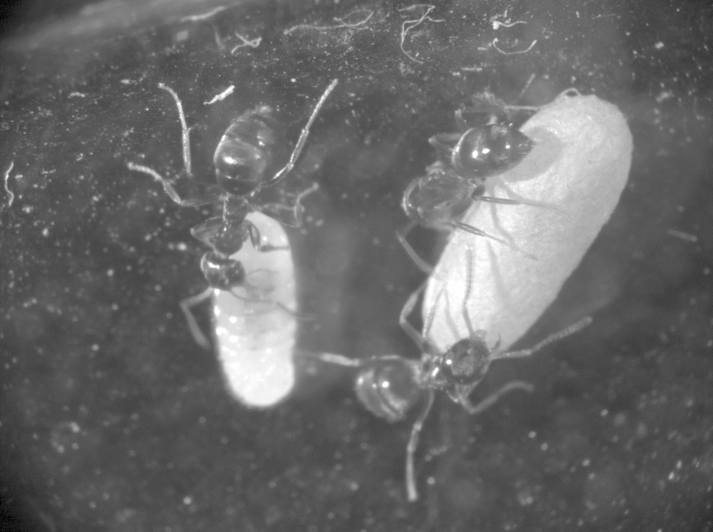
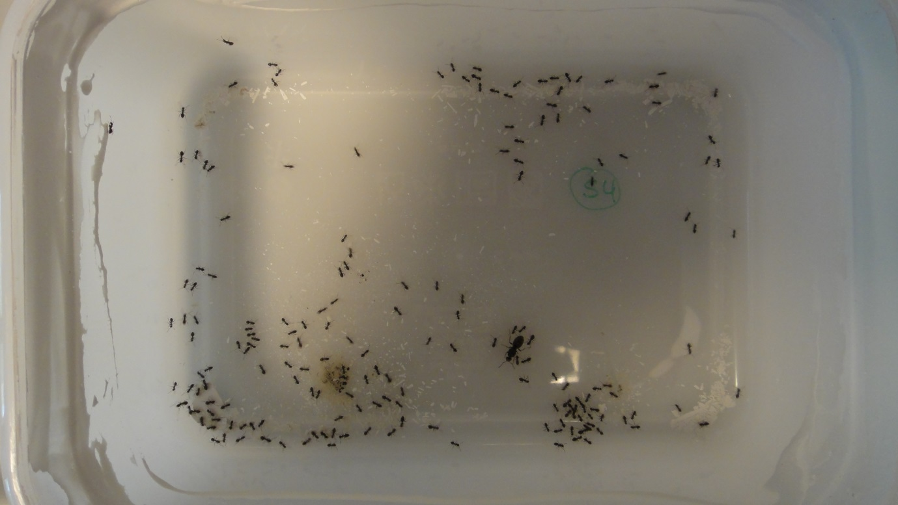
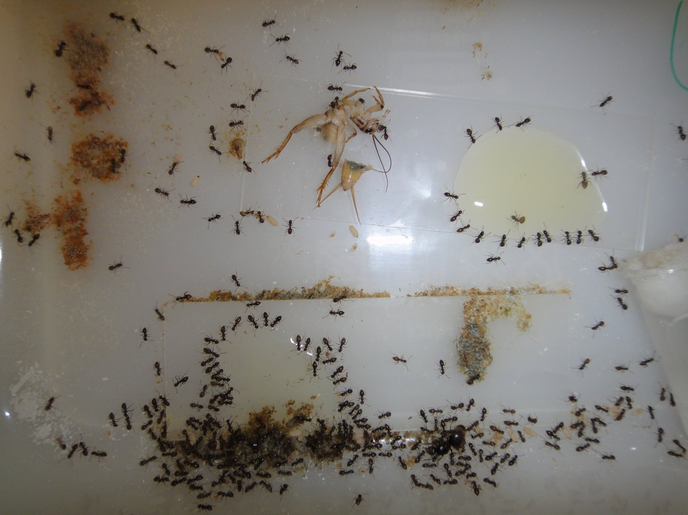

# Mieren verzorgen

Some Basic Information on keeping your Lasius niger colonies alive (and maybe happy)

The collected queens should now have laid eggs and provided the larvae, 
I think now the brood should be in pupae stage, 
meaning that the first workers will hatch soon. 
This means you should now be prepared to give the young colonies access to food. 

Larva (left) and pupa (right). Pupae are easy to distinguish as they have a brown dot on one end of the cocoon

Housing 
You can go for a simple plastic box, when I kept them in the lab I bought cheap bread boxes from ikea (ca. 10*15cm) and had no problems with those. One of those boxes per colony if fine for a start. Keep the test tube open it an put it in there and It should be fine . you can use a layer of talcum powder as an escape protection (mix it with water and and put it on the inner side of the plastic box 3-4 cm around the opening usually does a good job and contains no chemicals. 
Alternatively you can buils you own nests from gypsum (which is also nice as It can be saturated with water to provide soil like conditions). 
There are several other option, most pages I know are in german so probably not useful. Just google and you will probably find some alternative setups. Also you can buy stuff from antstores that provide all sorts of setups 

Simple plastic box with escape protection made of talcum (don’t worry there is usually food and a water source, this is a pic to count the ants)

Food
Water is the most importatn thing, ants can go without food for some time while without water, you can efficiently kill them. Easiest here is to stick to the test tube, water,cotton plug combination. Just add a new one if the old one is empty/dry. If there is some mold it doesn’t seem to be a plroblem for the ants, they most likely don’t want to move out of their initial nest in the fist time.
Basically they need a protein and a sugar source, you can be creative on what you offer and see how they accept the food you give them. Foodwise I fed them crickets and a mix of honey and water in a cotton ball ( as they manage to drown even in the smalles drops of homey-water (50-50%) mix. You may catch insects outside but then its good to boil them to avoid mites in you colonies, cutting them open may provide some important help fo small colonies with small initial workers. 

Cricket and honney-water (please use cotton an soak it with honey water, I know this looks nice here but some of your ne family mambers will drown) on a microscope slide

Other stuff
Keep you ants at a quiet place, even though disturbance is less and less critical as the colonies grow. 
Put them at a dark place. 
Don’t  put the boxes in the sun.
For the winter, once the brood composition is only larvae (probably somewhen in october november), you can cool them dowm and put then in the basement or close to ambient temperatutre somwhere else. 

Resources English: 
http://www.antfinity.com/articles/ant-keeping-guide-beginners/
http://www.antnest.co.uk/index.html
https://en.wikipedia.org/wiki/Black_garden_ant
http://www.antwiki.org/wiki/Lasius_niger
