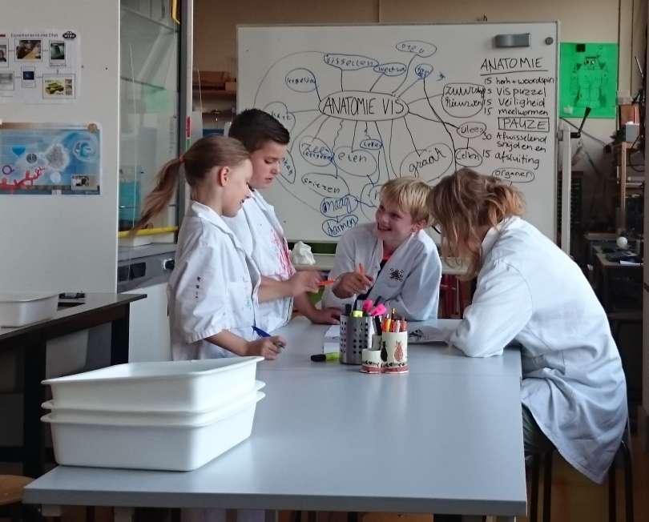
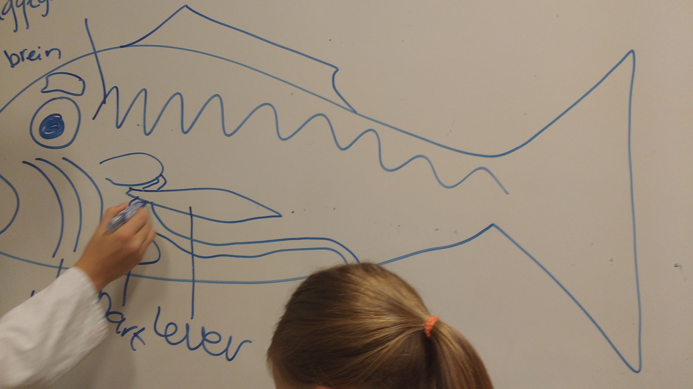
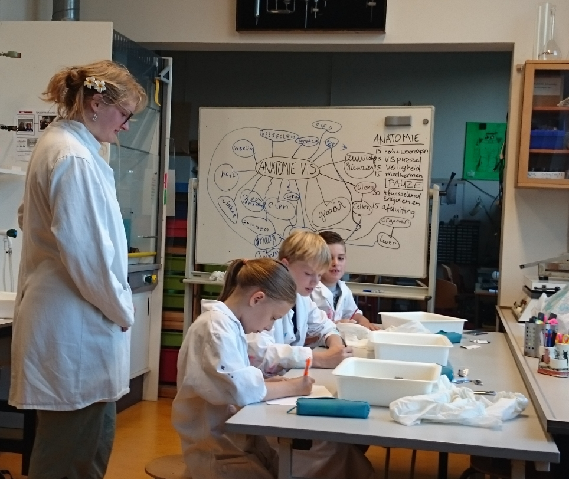
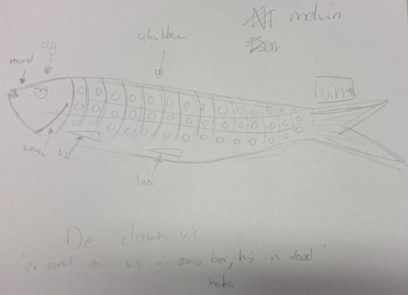
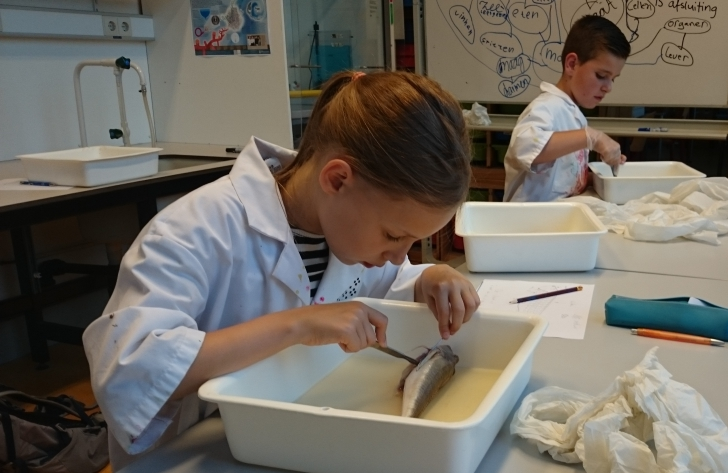
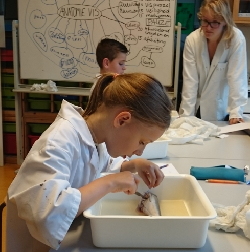
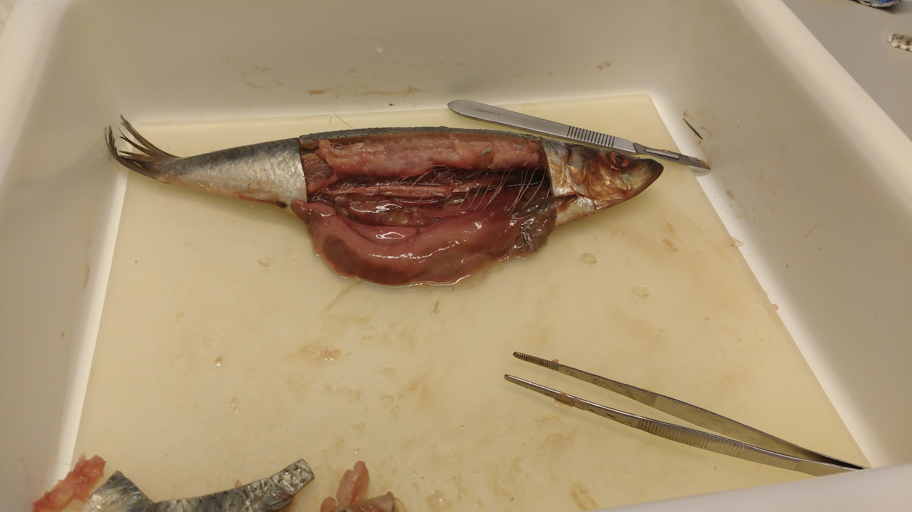
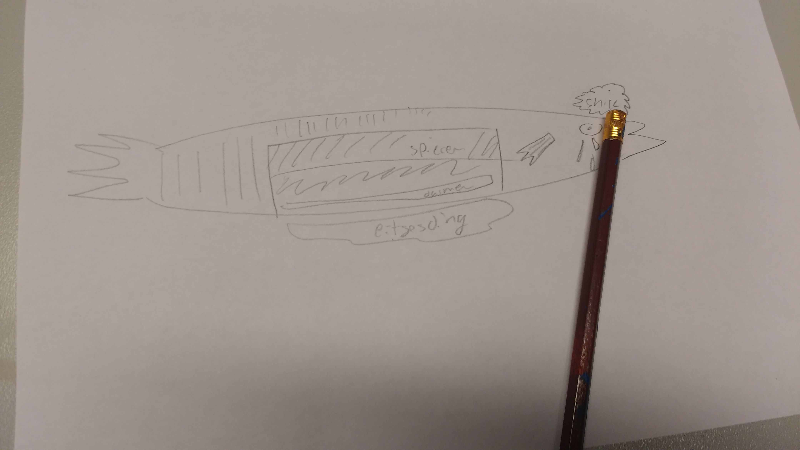
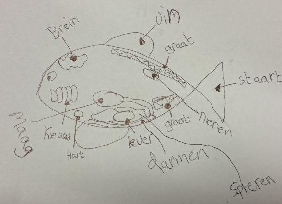

# Snijpracticum vis, 14 september 2016

Wat weten we al?

De belangrijkste organen van de vis in een schematische tekening op het whiteboard:

De leerlingen maken eerst een schematische tekening van de buitenkant van de vis:

Zoals deze:

Minderjarigen met scalpels [1]

Elke leerling heeft een eigen vis opengesneden met een eigen snijset: 

De leerlingen maken daarna een schematische tekening van de binnekant van de vis:

## Noten

[1] Rechts stond een docent met enige doel de veiligheid te bewaken