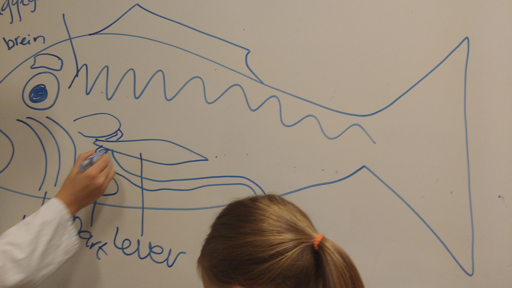
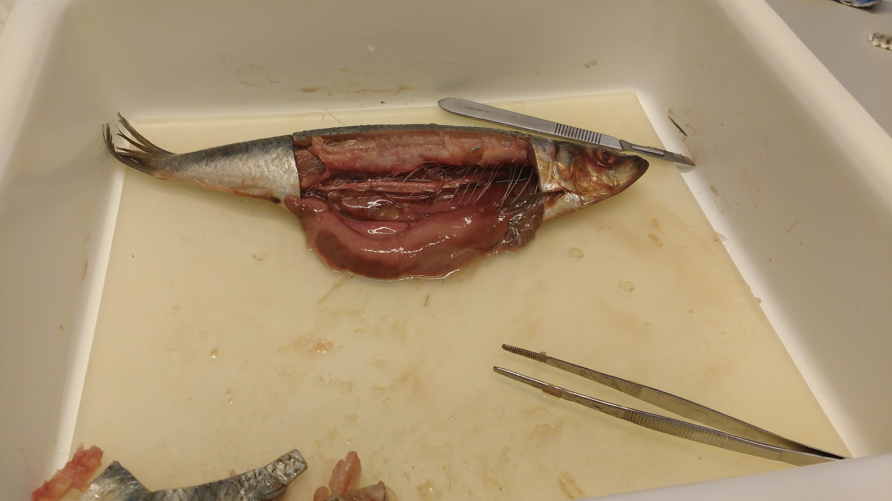
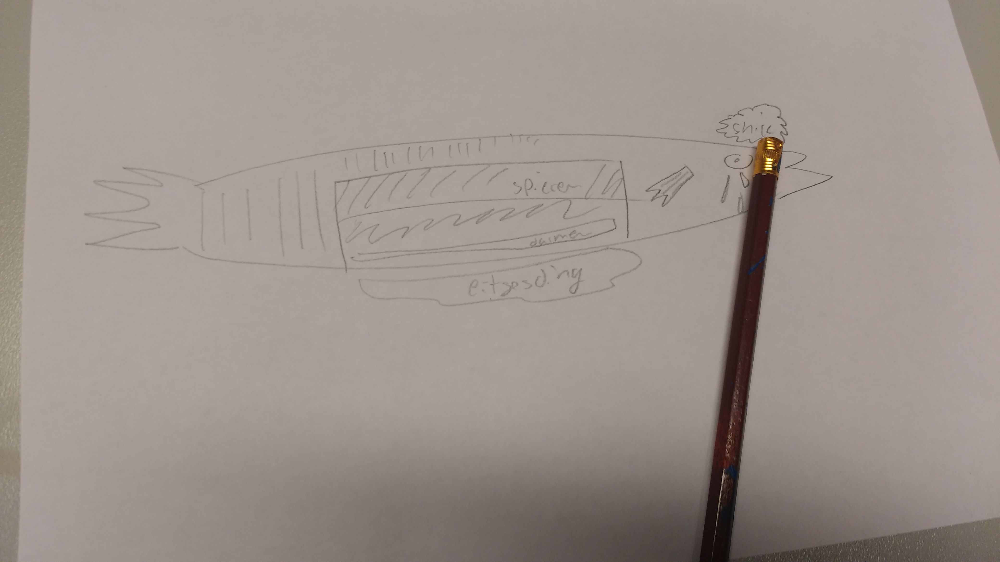

# Snijpracticum vis, 14 september 2016

De leerlingen maken eerst een schematische tekening van de buitenkant van de vis:

De belangrijkste organen van de vis in een schematische tekening op het whiteboard:

Elke leerling heeft een eigen vis opengesneden met een eigen snijset: 

De leerlingen maken daarna een schematische tekening van de binnekant van de vis:

