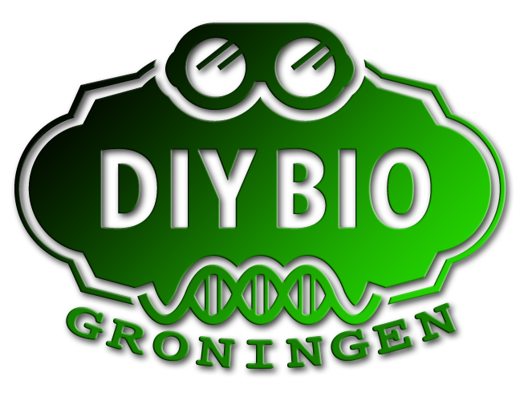

# Bio cursus

 

Met de Bio cursus doen we onderzoek aan alles dat leeft. Ook onszelf dus! 
En dat zijn ook heel veel verschillende dingen: van simpel naar buiten
gaan en data verzamelen, tot onderzoek aan DNA in het echt of op de computer.
Maar ook gaan we meelwormen kweken, gedrag van dieren (dus ook de mens) onderzoeken,
en organen/dieren ontleden.

Deze avond is een cursusavond, waarin samen onderzoeken en leren voorop staat. 
We gaan zowel doen als denken. Trek nooit je nette pak aan, want misschien gaan
we de natuur in :-)

 * Dag: Elke woensdagavond, behalve op feestdagen en in de kerstvakantie
 * Tijd: 
    * 18:15: inloop
    * 18:30: start les
    * 19:30: pauze
    * 19:45: start les
    * 20:30: einde les
 * Locatie: De Jonge Onderzoekers Groningen, www.djog.nl, Dirk Huizingastraat 13
 * Kosten per leerling:
   * September t/m december: 20 euro
   * Januari tot en met mei: 20 euro
   * Juni en juli: 10 euro
 * Leeftijd: 8-25 jaar
 * Benodigdheden: Laptop met WiFi

Zie [hier het rooster](Rooster.md).
 
# Veelgestelde vragen

Zie [Veelgestelde vragen](FAQ.md)